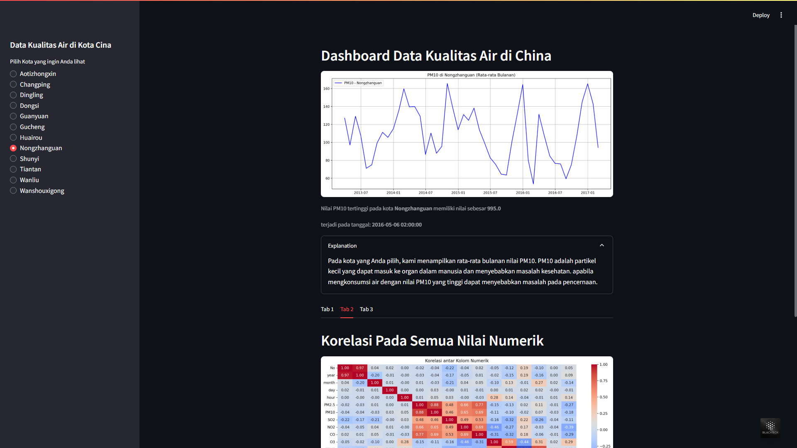
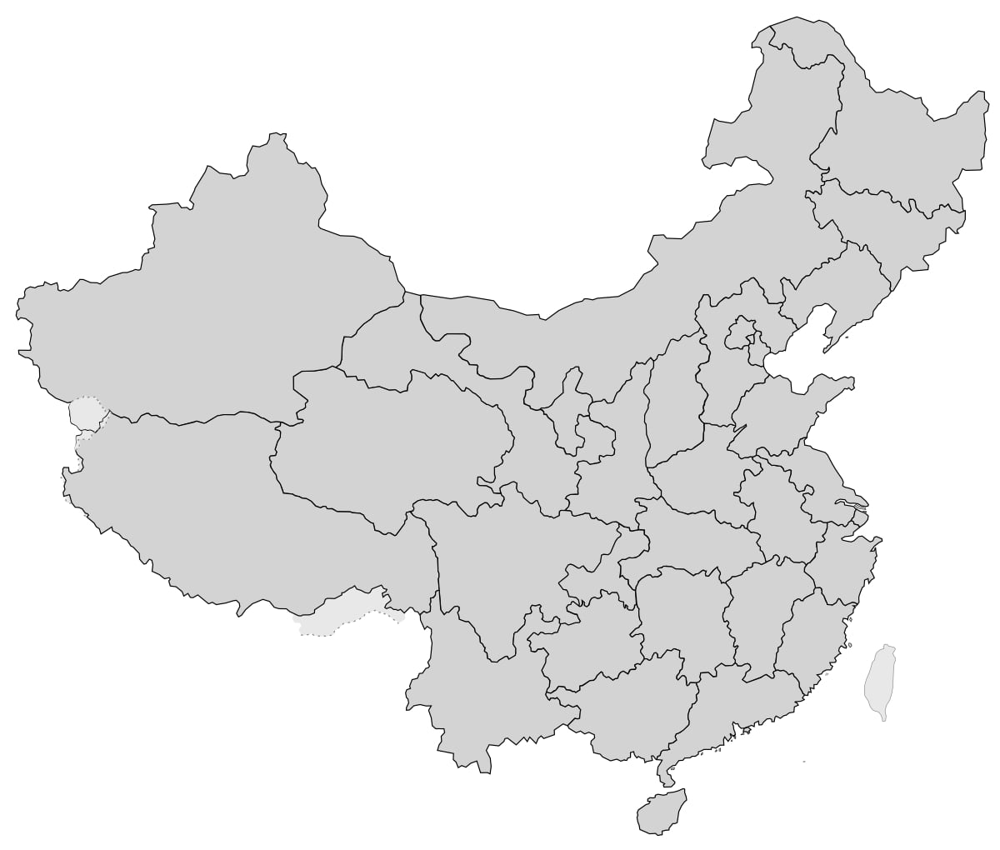

# Submission_analisis_data_dengan_python
submission kelas dicoding analisis data dengan python dengan membuat analisa dari data kualitas udara di kota China. Ini adalah proyek akhir dari kursus "Belajar Analisis Data dengan Python" dari Dicoding. berikut adalah informasi tahapan analisis data mulai dari data Wrangling, Exploratory Data Analysis, dan Data Visualization. selanjutnya adalah membuat dashboard menggunakan streamlit yang kemudian di deploy agar dapat diakses semua orang.

## Dataset
https://drive.google.com/file/d/1RhU3gJlkteaAQfyn9XOVAz7a5o1-etgr/view

## 1. Data Wrangling:
- Gathering data
- Assessing data
- Cleaning data
## 2. Exploratory Data Analysis:
- Defined business questions for data exploration
- Create Data exploration
## 3. Data Visualization or Explanatory data:
- Create Data Visualization that answer business questions
## 4. Dashboard:
- Set up the DataFrame which will be used
- Make filter components on the dashboard
- Complete the dashboard with various data visualizations

terdapat dua file pengerjaan yaitu
dashboard.py (berisi informasi dari data wranngling, exploratory data analiysis, explanatory data)
notebook.ipynb (berisi informasi dari pembuatan dashboard)

### **notebook.ipynb**  
1. Unduh proyek ini.  
2. Buka IDE Jupyter Notebook atau Google Colaboratory (di sini saya menggunakan Google Colab).  
3. Buat Notebook baru.
4. Unggah dan pilih file dengan ekstensi **.ipynb**.  
5. Hubungkan ke runtime yang tersedia.  
6. Jalankan setiap sel kode.  

### **dashboard/dashboard.py**  
1. Unduh proyek ini.  
2. Instal **Streamlit** melalui terminal atau command prompt dengan perintah:  
   ```sh
   pip install streamlit
   ```  
   Jika belum terinstal, tambahkan pustaka lainnya seperti **pandas, numpy, scipy, matplotlib,** dan **seaborn**.  
3. Pastikan file **CSV** tetap berada di folder yang sama dengan **dashboard.py**, karena berfungsi sebagai sumber data.  
4. Buka **VSCode**, lalu jalankan file dengan membuka terminal dan ketik:  
   ```sh
   streamlit run dashboard.py
   ```
## Lampiran halaman Dashboard


